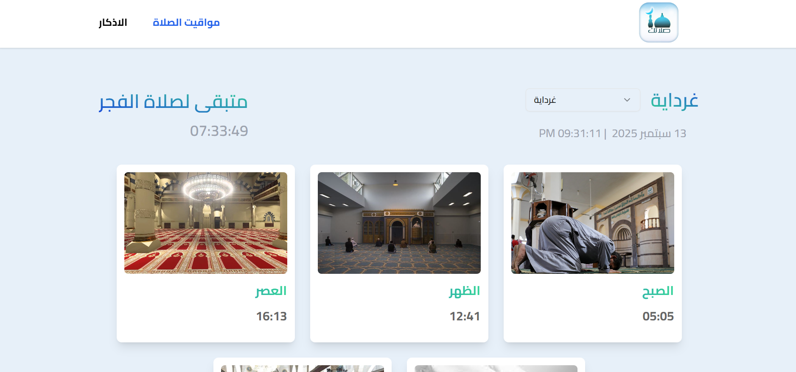
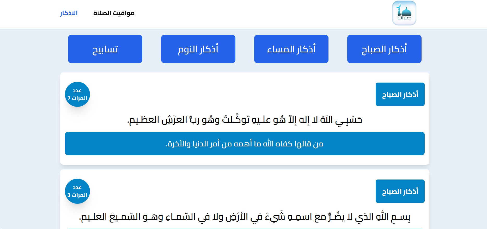

# 🕌 مشروع: مواقيت الصلاة لكل ولايات الجزائر

## 📖 الوصف
تطبيق ويب يعرض مواقيت الصلاة حسب **الولايات الجزائرية**.  
يمكن للمستخدم اختيار أي ولاية لعرض مواقيت الصلاة المحلية مع **الوقت المتبقي للصلاة التالية**.  

كما يحتوي المشروع على صفحة **الأذكار** (نوم، صباح، مساء، تسابيح) يتم جلبها من API خارجي.  


---

## ✨ المميزات
- 🏙️ اختيار الولاية الجزائرية من قائمة.
- 🕒 عرض مواقيت الصلاة (الفجر، الظهر، العصر، المغرب، العشاء).
- ⏳ حساب وعرض الوقت المتبقي للصلاة القادمة بشكل ديناميكي.
- 📜 صفحة الأذكار:
  - نوم 🛏️
  - صباح 🌅
  - مساء 🌆
  - تسابيح ✨
- 🔗 جلب البيانات من API خارجي.
- 📱 تصميم متجاوب ومتوافق مع مختلف الأجهزة.

---

## الصفحة الرئيسية


---
## صفحة الأذكار


---


## 🛠️ التقنيات المستعملة
- **Frontend :** [React.js](https://react.dev/) + [Tailwind CSS](https://tailwindcss.com/) + [Shadcn/ui](https://ui.shadcn.com/docs/components)
- **Data API :** [Aladhan](https://aladhan.com/) , [Adhkar](https://raw.githubusercontent.com/nawafalqari/azkar-api/56df51279ab6eb86dc2f6202c7de26c8948331c1/azkar.json)
- **Hosting & Deployment:** [Netlify](https://www.netlify.com/) 
- **Version Control:** [Git](https://git-scm.com/) + [GitHub](https://github.com/)
- **Build Tool:** [Vite](https://vitejs.dev/)


---


## ⚡ عملية التثبيت
تشغيل المشروع محليا  :

```bash
# Clone the repository
git clonehttps://github.com/Naadix/Salatuk-App.git

# Navigate into the project folder
cd Salatuk-App

# Install dependencies
npm install

# Start the development server
npm run dev
